<h1 align="center">
  DrawSVG
</h1>

# Overview

A simple interactive program that renders SVG files, it draws points, lines, triangles, and bitmap images. The code skeleton was provided by [cmu's introduction to computer garphics course](http://15462.courses.cs.cmu.edu/fall2021/) so I implemented algorithms for rasterizing primitives efficiently. It supports supersampling, transformations, viewport navigation & alpha blending. To see build instructions, scroll down to the bottom of this readme.

### Summary of Viewer Controls

A table of all the keyboard controls in the **draw** application is provided below.

```

| Command                                           |  Key  |
| ------------------------------------------------- | :---: |
| Go to tab                                         | 1 ~ 9 |
| Switch to hw renderer                             |   H   |
| Switch to sw renderer                             |   S   |
| Toggle sw renderer impl (student soln/ref soln)   |   R   |
| Regenerate mipmaps for current tab (student soln) |   ;   |
| Regenerate mipmaps for current tab (ref soln)     |   '   |
| Increase samples per pixel                        |   =   |
| Decrease samples per pixel                        |   -   |
| Toggle text overlay                               |   `   |
| Toggle pixel inspector view                       |   Z   |
| Toggle image diff view                            |   D   |
| Reset viewport to default position                | SPACE |

```

Other controls:

- Panning the view: click and drag the cursor
- Zooming in and out: scroll wheel (typically a two-finger drag on a trackpad)

# Features and Results

### Pipeline


The program reads in an SVG and initiates the window via context setup. The SVG is then parsed into a set of primitives, and the `draw_elements` function is called on each SVG element, rasterizing the primitives to pixels in the sample buffer. Pixels in the sample buffer are then filtered in the `resolve` function and sent to the target buffer where they are displayed onscreen. The above diagram illustrates how each task falls into the pipeline. The sample buffer takes multiple samples per pixel, and adjacent pixels in the sample buffer are averaged together for each target buffer pixel.

### Hardware Renderer

Using OpenGL to implement `rasterize_point()`, `rasterize_line()`, and `rasterize_triangle()` in `hardware/hardware_renderer.cpp`. to view rendered SVG's by this we simply run DrawSVG and press `h`.

For all of the other features, all of them were implemented **without OpenGL**. So the rasterization algorithms were impelemented from scratch.

<div align="center">
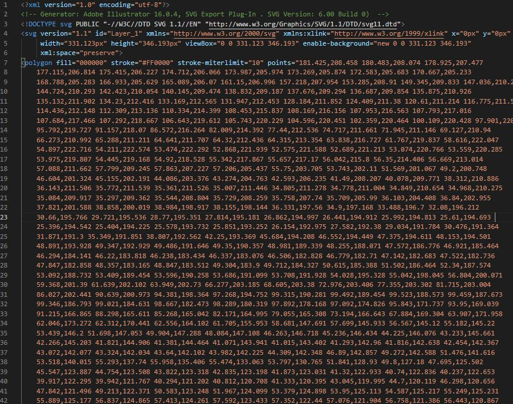
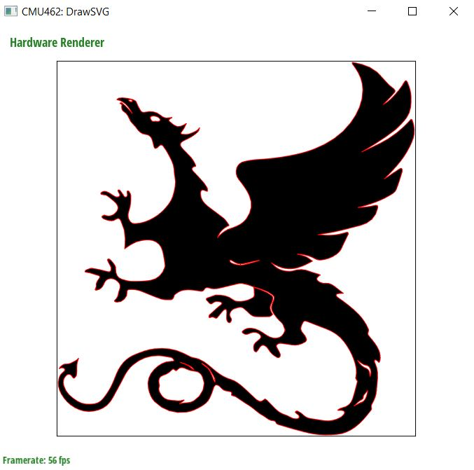
</div>

<div align="center">
  <b>rendering <i>basic/test3.svg</i> using OpenGL's API</b>
</div>
<br/>

### Drawing Lines

By implementing the function `rasterize_line()` in `software_renderer.cpp`, Lines are rendered while:

<div align="center">
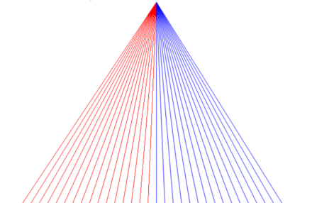
</div>
<div align="center">
  <b>Bresenham vs Xiaolin Wu's line algorithm</b>
</div>
<br/>

- Handling non-integer vertex coordinates passed to `rasterize_line()`.
- Handling lines of any slope.
- Performing work proportional to the length of the line (**O(n)**).
- Supporting specifying a line width (by splitting into 2 traingles).
- Variable width from start and end.
- Supports two line drawing algorithms:
  - **Bresenham's algorithm (shown in red above)** if anti-aliasing is false.
  - **Xiaolin Wu's line algorithm (shown in blue above)** if anti-aliasing is true.

<div align="center">
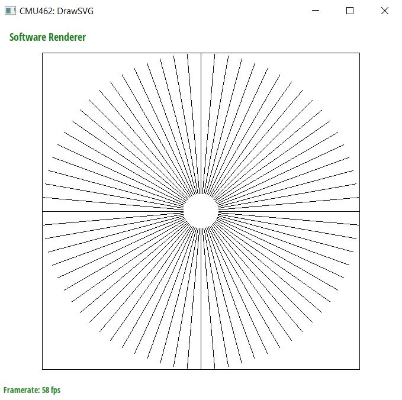
</div>

<div align="center">
  <b>rendering <i>basic/test2.svg</i>: Bresenham's algorithm</b>
</div>
<br/>

<div align="center">
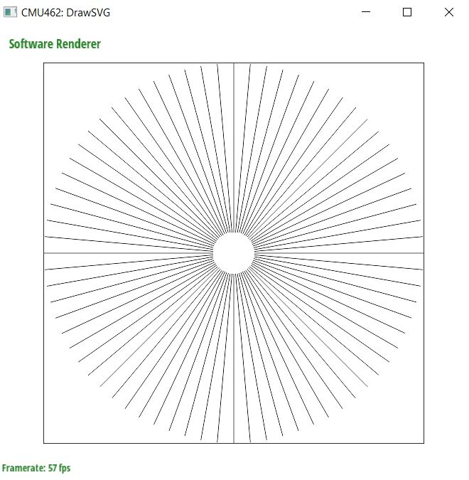
</div>

<div align="center">
  <b>rendering <i>basic/test2.svg</i>: Xiaolin Wu's line algorithm (anti-aliasing)</b>
</div>
<br/>

<div align="center">
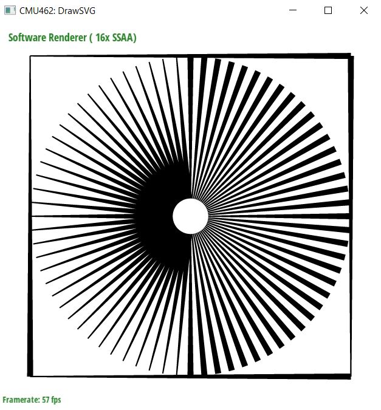
</div>

<div align="center">
  <b>rendering <i>basic/test2.svg</i>: Variable End & Start Widthes</b>
</div>
<br/>

TODO:

### Drawing Traingles

By implementing `rasterize_triangle()` in `software_renderer.cpp` and creating a variety of helper functions, Triangles are rendered as follows:

1. Get the bounding box of the triangle
2. recusively divide the box in the larger axis in half and check the resulting boxes:

- if the box is smaller than given a threshold (i.e. <8x8): `simply check all pixels inside`
- else:
  - if the box is all in the he triangle: `fill without checking`
  - if the box is all outside of the triangle: `do nothing`
  - else: `step 2 (divide again)`

<div align="center">
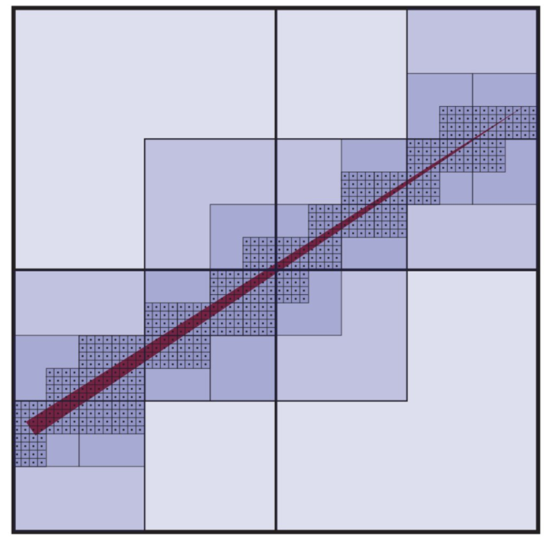
</div>
<br/>

Checked boxes for this approach look like this. It is clear that this algorithm is very efficient compared to the naive search on all pixels in the bounding box.

**Below are some examples of rendered SVGs:**

<div align="center">
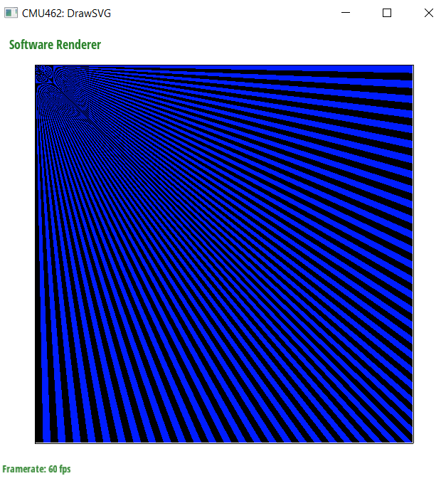
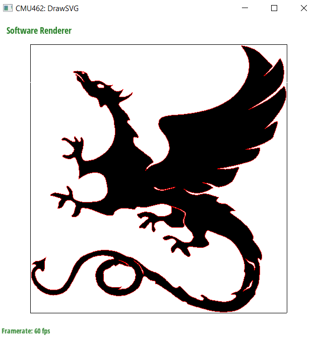
</div>
<div align="center">
  <b>Some example on Triangle Rasterization</b>
</div>
<br/>

### Supersampling

By implementing `resolve()` in `software_renderer.cpp` and modifying `rasterize_triangle()` & `rasterize_line()` , Supersampling is supported. Some notes:

- Uniform sample positions.
- Supersampling upto 16 samples/px.
- A simple box filter is used to average samples.

This was tested against extreme SVG files (in terms of numbers of triangles). It worked efficiently.

<div align="center">
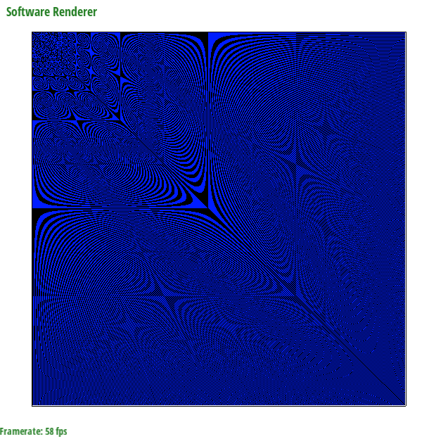
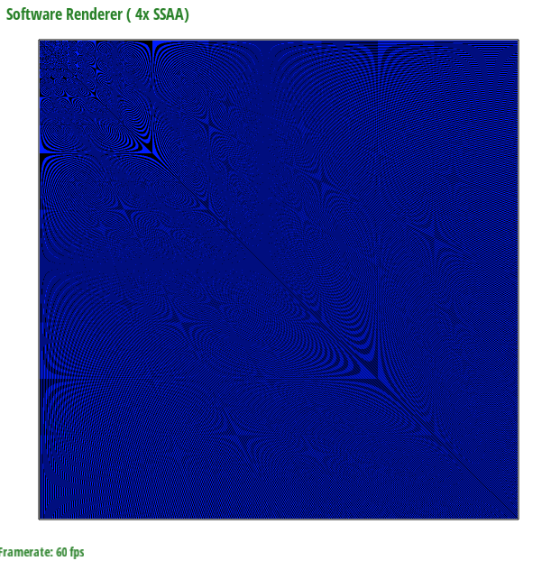
</div>
<div align="center">
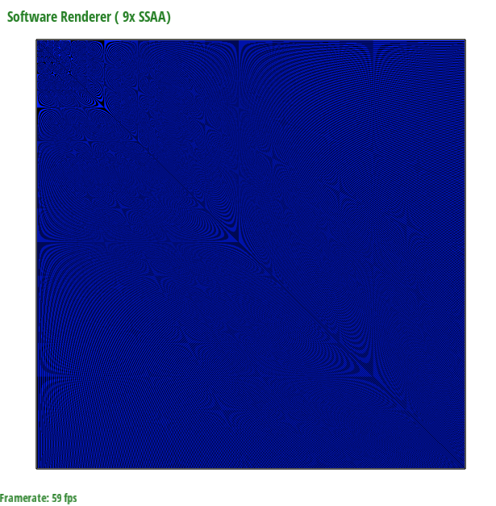
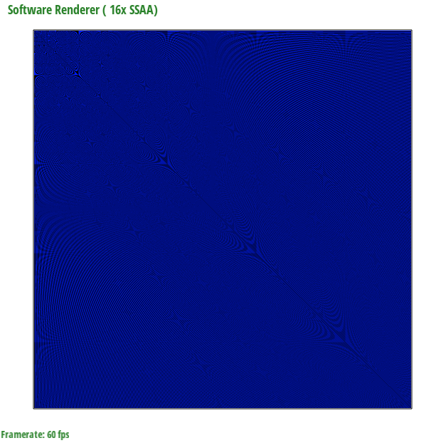
</div>
<div align="center">
  <b>Showing an extreme aliasing case and how it looks with different sampling rates</b>
</div>
<br/>

### Transformations & Viewport Navigation

By modifying `draw_svg()` and `draw_element()` `software_renderer.cpp`, Transformations take effect rendered:

- Supports all simple transformations (translation, scaling, rotation, shearing, perspective projection)
- Supports trees of transformations: A hierarchy of transformations and each child transformation is described relative to its parents

The example shown below illustrates these two properties by creating artwork by transforming clones of only 2 objects.

<div align="center">
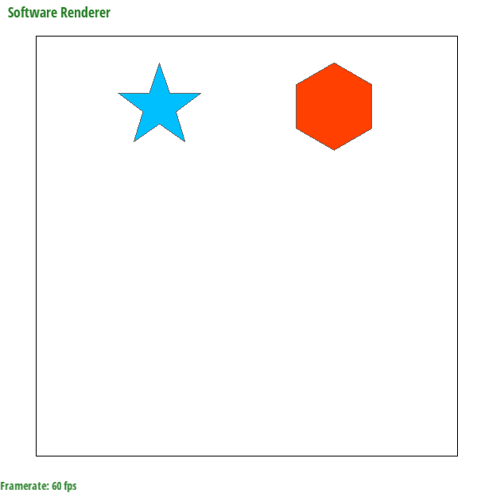
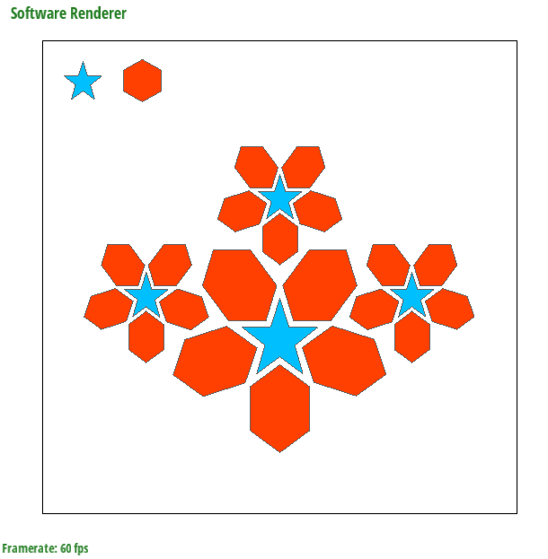
</div>
<div align="center">
  <b>rendering <i>basic/test6.svg</i> before and after implementing transformations</b>
</div>
<br/>

By implementing `ViewportImp::set_viewbox()` in `viewport.cpp`, the following is supported:

<div align="center">

<pre>
| Command                            |    Key    |
| ---------------------------------- | :-------: |
| Zoom in                            | Touch Pad |
| Zoom out                           | Touch Pad |
| Move the origin                    | Mouse Pan |
| Reset viewport to default position |   SPACE   |
</pre>

  
</div>
<br/>

### Rendering Scaled Images

<div align="center">
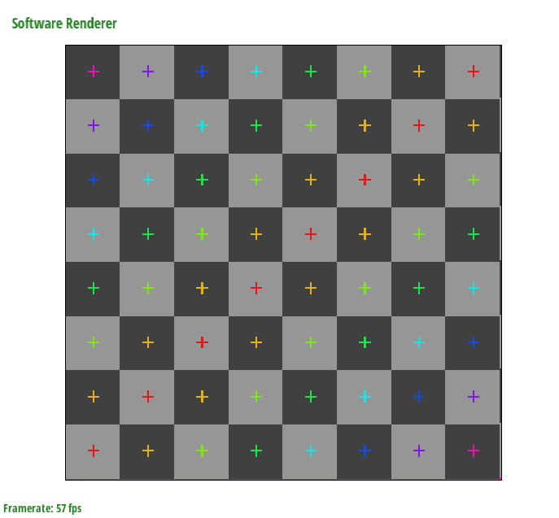
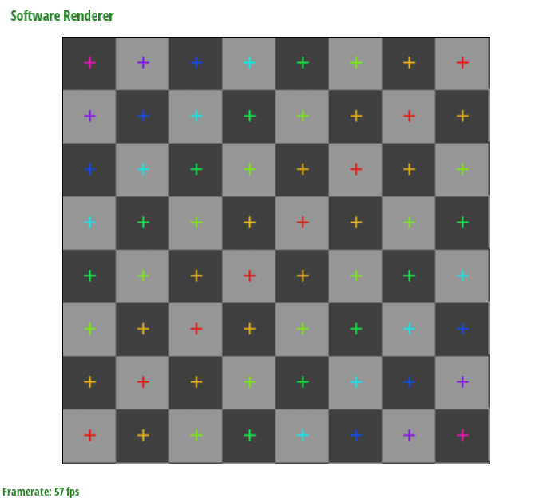
</div>
<div align="center">
  <b>rendering <i>basic/test7.svg</i>: Nearest Neigbor vs Bilinear Interpolation</b>
</div>
<div align="center">
  The aliasing effect is obvious if we look at the + signs as they have different thicknesses and lengthes/widthes
</div>
<br/>

<div align="center">
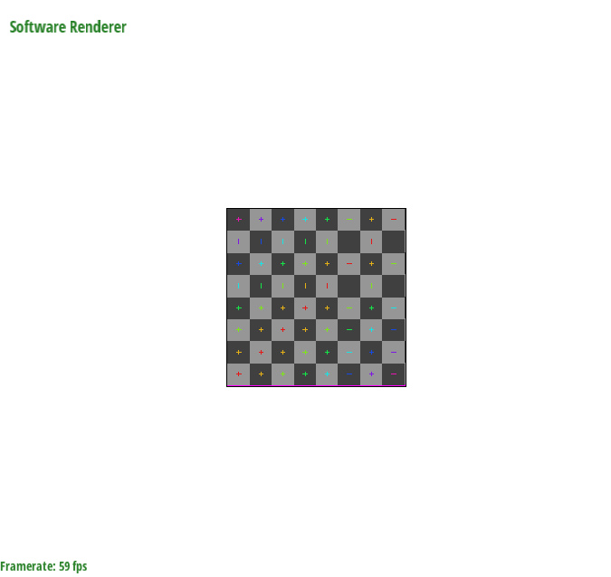
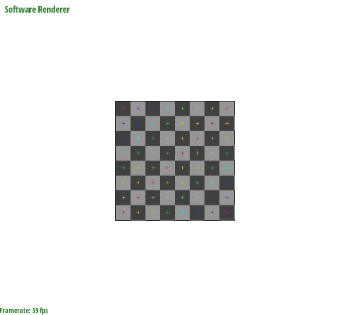
</div>
<div align="center">
  <b>rendering <i>basic/test7.svg</i>: Nearest Neigbor vs Bilinear Interpolation</b>
</div>
<div align="center">
  The aliasing effect is obvious if we look at the + signs as they have different thicknesses and lengthes/widthes
</div>
<br/>

**This part of the assignment requires knowledge of concepts in Lecture _Perspective Projection and Texture Mapping_.**

In this task, you will implement `rasterize_image()` in `software_renderer.cpp`.

To keep things very simple, we are going to constrain this problem to rasterizing image elements that are positioned on the SVG canvas via translations and scaling, **but not rotations**. Therefore, `rasterize_image()` should render the specified image into an axis-aligned rectangle on screen whose top-left coordinate is `(x0, y0)` and whose bottom-right coordinate is `(x1, y1)`. Your implementation should adhere to the following specification:

- The image element should cover all screen samples inside the specified rectangle.
- For each image, texture space spans a [0-1]^2 domain as described in class. That is, given the example above, the mapping from screen-space to texture-space is as follows: `(x0, y0)` in screen space maps to image texture coordinate `(0, 0)` and `(x1, y1)` maps to `(1, 1)`.
- You may wish to look at the implementation of input texture images in `texture.h/.cpp`. The class `Sampler2D` provides skeleton of methods for nearest-neighbor (`sample_nearest()`), bilinear (`sample_bilinear()`), and trilinear filtering (`sample_trilinear()`). There is a pre-existing instance of Sampler2D, `sampler`, in `software_renderer.h`.
- In this task, for each covered sample, the color of the image at the specified sample location should be computed using **bilinear filtering** of the input texture. Therefore you should implement `Sampler2D::sample_bilinear()` in `texture.cpp` and call it from `rasterize_image()`. (However, we recommend first implementing `Sampler2D::sample_nearest()` -- as nearest neighbor filtering is simpler and will be given partial credit.)
- As discussed in class, please assume that image pixels correspond to samples at half-integer coordinates in texture space.
- The `Texture` struct stored in the `Sampler2D` class maintains multiple image buffers corresponding to a mipmap hierarchy. In this task, you will sample from level 0 of the hierarchy: `Texture::mipmap[0]`. In other words, if you call one of the samplers above, you should pass in `0` for the level parameter.

When you are done, you should be able to draw `basic/test7.svg`.

### Anti-Aliasing Image Elements Using Trilinear Filtering

**This part of the assignment requires knowledge of concepts in Lecture _Perspective Projection and Texture Mapping_.**

In this task you will improve your anti-aliasing of image elements by adding trilinear filtering. This will involve generating mipmaps for image elements at SVG load time and then modifying your sampling code from Task 6 to implement trilinear filtering using the mipmap. Your implementation is only required to work for images that have power-of-two dimensions in each direction.

- To generate mipmaps, you need to modify code in `Sampler2DImp::generate_mips()` in `texture.cpp`. Code for allocating all the appropriate buffers for each level of the mipmap hierarchy is given to you. However, you will need to populate the contents of these buffers from the original texture data in level 0. **Your implementation can assume that all input texture images have power of two dimensions. (But it should not assume inputs images are square.)**
- Then modify your implementation of `rasterize_image()` from Task 6 to perform trilinear filtered sampling from the mipmap. Your implementation will first need to compute the appropriate level at which to sample from the mip-hierarchy. Recall from class that as image elements shrink on screen, to avoid aliasing the rasterizer should sample from increasingly high (increasing prefiltered) levels of the hierarchy.
- The method `Sampler2D::sample_trilinear()` has two parameters, `u_scale` and `v_scale`, which depend on the sample rate and the size of the image. It is up to you how to use them.

The program only stores a single set of mipmaps for each image, so the `rasterize_image()` routine (both your implementation and the reference solution) will use whichever mipmaps have been generated most recently using the `'` and `;` keys. Be sure you are testing with your own mipmaps and not the reference ones.

At this point, zooming in and out of your image should produce nicely filtered results! To test this functionality, try zooming out on `basic/test7.svg`.

### Alpha Compositing

Up until this point your renderer was not able to properly draw semi-transparent elements. Therefore, your last programming task in this assignment is to modify your code to implement [Simple Alpha Blending](http://www.w3.org/TR/SVGTiny12/painting.html#CompositingSimpleAlpha) in the SVG specification.

Note that in the above link, all the element and canvas color values assume **premultiplied alpha**. Refer to lecture _Depth and Transparency_ and [this blog post](https://developer.nvidia.com/content/alpha-blending-pre-or-not-pre) for the differences between premultiplied alpha and non-premultiplied alpha.

While the application will always clear the render target buffer to the canvas color at the beginning of a frame to opaque white ((255,255,255,255) in RGBA) before drawing any SVG element, your transparency implementation should make no assumptions about the state of the target at the beginning of a frame.

You will need to modify the parts of the code which write to the supersample buffer.

When you are done, you should be able to correctly draw the tests in `/alpha`.

# Draw Something!!!

_Below are the instrusctions for rendering your own SVG art in this application._

You can create an SVG file in popular design tools like Adobe Illustrator or Inkscape and export SVG files, or use a variety of editors online. Since an SVG file is just an XML file, you could even use a text editor or write a script to generate the text!

Be aware that our starter code and your renderer implementation only support a **subset** of the features defined in the SVG specification, and applications like Adobe Illustrator or Inkscape may not always encode shapes with the primitives we support. (You may need to convert complicated paths to the basic primitives in these tools. This [Path to Polygon Converter](https://betravis.github.io/shape-tools/path-to-polygon/) might be of use.)

If you're using InkScape, and you save your drawing in InkScape as an `InkScape` svg or `Plain` svg, the entire drawing will appear black in DrawSVG.
To work around this, you should instead save it as an `Optimized SVG`. In the resulting dialog, be sure to select `Convert CSS attributes to XML attributes`, and _deselect_ `Shorten color values`.

If you're using Illustrator, and you get errors with opening your generated SVG file in DrawSVG, make sure your `<svg>` tag contains a `width` and `height` field, with set values. Look at the test case SVGs in the `svg/` folder for reference.

# Build Instructions

In order to ease the process of running on different platforms, we will be using [CMake](http://www.cmake.org/) for our assignments. You will need a CMake installation of version 2.8+ to build the code for this assignment. It should also be relatively easy to build the assignment and work locally on Windows, OSX or 64-bit version of Linux. Building on ARM (e.g. Raspberry Pi, some Chromebooks) is currently not supported.

### VSCode Build Instructions (All Platforms)

We recommend using [Visual Studio Code](https://code.visualstudio.com/download) on all platforms. Once you install CMake and VSCode, you will also need to install the C/C++ extension within VSCode.

The build and launch data is contained within the `.vscode` directory. Select the folder for your compiler and move `launch.json` and `tasks.json` up one level into the `.vscode` directory. To set commandline arguments, go to `launch.json` and add them within `args`. For example, to run the program with test 1, you would add `./basic/test1.svg`. You can build using <kbd>Ctrl</kbd>+<kbd>Shift</kbd>+<kbd>B</kbd> and debug using <kbd>F5</kbd>. If you feel that your program is running slowly, you can also change the build mode to `Release` from `Debug`.

Commonly used Hotkeys:

- <kbd>Ctrl</kbd>+<kbd>Shift</kbd>+<kbd>B</kbd> - Build
- <kbd>F5</kbd> - Debug
  - <kbd>F9</kbd> - Toggle Breakpoint
  - <kbd>F10</kbd> - Step Over
  - <kbd>F11</kbd> - Step Into
  - <kbd>Shift</kbd>+<kbd>F5</kbd> - Stop
- <kbd>Ctrl</kbd>+<kbd>P</kbd> - Search for file
- <kbd>Ctrl</kbd>+<kbd>Shift</kbd>+<kbd>P</kbd> - Run Command
- Right click to go to definition/declaration/references

### OS X/Linux Build Instructions

If you are working on OS X and do not have CMake installed, we recommend installing it through [Homebrew](http://brew.sh/): `$ brew install cmake`. You may also need the freetype package `$ brew install freetype`.

If you are working on Linux, you should be able to install dependencies with your system's package manager as needed (you may need cmake and freetype, and possibly others).

To build your code for this assignment:

```
$ cd DrawSVG && mkdir build && cd build
$ cmake ..
$ make
```

These steps (1) create an out-of-source build directory, (2) configure the project using CMake, and (3) compile the project. If all goes well, you should see an executable `drawsvg` in the build directory. As you work, simply typing `make` in the build directory will recompile the project.

### Windows Build Instructions using Visual Studio

We have a beta build support for Windows systems. You need to install the latest version of [CMake](http://www.cmake.org/) and install [Visual Studio Community](https://visualstudio.microsoft.com/vs/). After installing these programs, you can run `runcmake_win.bat` by double-clicking on it. This should create a `build` directory with a Visual Studio solution file in it named `drawsvg.sln`. You can double-click this file to open the solution in Visual Studio.

If you plan on using Visual Studio to debug your program, you can change `drawsvg` project in the Solution Explorer as the startup project by right-clicking on it and selecting `Set as StartUp Project`. You can also set the commandline arguments to the project by right-clicking `drawsvg` project again, selecting `Properties`, going into the `Debugging` tab, and setting the value in `Command Arguments`. If you want to run the program with the basic svg folder, you can set this command argument to `../../svg/basic`. After setting all these, you can hit F5 to build your program and run it with the debugger.

If you feel that your program is running slowly, you can also change the build mode to `Release` from `Debug` by clicking the Solution Configurations drop down menu on the top menu bar. Note that you will have to set `Command Arguments` again if you change the build mode.

### Windows Build Instructions Using CLion

(tested on CLion 2018.3)

Open CLion, then do `File -> Import Project..`

In the popped out window, find and select the project folder `...\DrawSVG`, click OK, click Open Existing Project, then select New Window

Make sure the drop down menu on top right has drawsvg selected (it should say `drawsvg | Debug`). Then open the drop down menu again and go to Edit Configurations..

Fill in Program arguments, say, `./svg/basic`, then click Apply and close the popup

Now you should be able to click on the green run button on top right to run the project.

### Using the Mini-SVG Viewer App

When you have successfully built your code, you will get an executable named **drawsvg**. The **drawsvg** executable takes exactly one argument from the command line. You may load a single SVG file by specifying its path. For example, to load the example file `svg/basic/test1.svg` :

```
./drawsvg ../svg/basic/test1.svg
```

When you first run the application, you will see a picture of a flower made of a bunch of blue points. The starter code that you must modify is drawing these points. Now press the R key to toggle display to the staff's reference solution to this assignment. You'll see that the reference differs from "your solution" in that it has a black rectangle around the flower. (This is because you haven't implemented line drawing yet!)

While looking at the reference solution, hold down your primary mouse button (left button) and drag the cursor to pan the view. You can also use scroll wheel to zoom the view. (You can always hit SPACE to reset the viewport to the default view conditions). You can also compare the output of your implementation with that of the reference implementation. To toggle the diff view, press D. We have also provided you with a "pixel-inspector" view to examine pixel-level details of the currently displayed implementation more clearly. The pixel inspector is toggled with the Z key.

For convenience, `drawsvg` can also accept a path to a directory that contains multiple SVG files. To load files from `svg/basic`:

```
./drawsvg ../svg/basic
```

The application will load up to nine files from that path and each file will be loaded into a tab. You can switch to a specific tab using keys 1 through 9.

# Project Structure

```
📁DrawSVG
├─ 💬.gitignore
├─ 📁.vs
├─ 📁.vscode
│  ├─ 📁clang
│  ├─ 📁gcc
│  ├─ 📊launch.json
│  ├─ 📁msvc
│  ├─ 📊settings.json
│  └─ 📊tasks.json
├─ 📁CMakeFiles
├─ 💬CMakeLists.txt
├─ 📁CMU462
├─ 📁doc
├─ 💻drawsvg.sln
├─ 📁image
│  └─ 📁README
├─ 📁misc
├─ 💬README.md
├─ 💻runcmake_win.bat
├─ 📁src
│  ├─ 📁cmake
│  │  └─ 📁modules
│  │     ├─ 💻FindCMU462.cmake
│  │     ├─ 💻FindGLEW.cmake
│  │     └─ 💻FindGLFW.cmake
│  ├─ 📁CMakeFiles
│  ├─ 💬CMakeLists.txt
│  ├─ 📁dirent
│  │  ├─ © dirent.c
│  │  └─ © dirent.h
│  ├─ © drawsvg.cpp
│  ├─ © drawsvg.h
│  ├─ 📁hardware
│  │  ├─ hardware.cmake
│  │  └─ hardware_renderer.cpp
│  ├─ © hardware_renderer.h
│  ├─ © main.cpp
│  ├─ © png.cpp
│  ├─ © png.h
│  ├─ 📁reference
│  │  ├─ 💻drawsvg_ref.lib
│  │  ├─ 💻libdrawsvgref.a
│  │  ├─ 💻libdrawsvgref_old.a
│  │  ├─ 💻libdrawsvgref_osx.a
│  │  └─ 💻reference.cmake
│  ├─ © software_renderer.cpp
│  ├─ © software_renderer.h
│  ├─ © svg.cpp
│  ├─ © svg.h
│  ├─ © svg_renderer.h
│  ├─ © texture.cpp
│  ├─ © texture.h
│  ├─ © triangulation.cpp
│  ├─ © triangulation.h
│  ├─ © viewport.cpp
│  └─ © viewport.h
├─ 📁svg
│  ├─ 🎨alpha
│  ├─ 🎨basic
│  ├─ 🎨hardcore
│  ├─ 🎨illustration
│  └─ 🎨subdiv
└─ 💻 win_clean.bat

```

# Resources and Notes

- [Rasterization Rules in Direct3D 11](<https://msdn.microsoft.com/en-us/library/windows/desktop/cc627092(v=vs.85).aspx>)
- [Rasterization in OpenGL 4.0](https://www.opengl.org/registry/doc/glspec40.core.20100311.pdf#page=156)
- [Bryce Summer's C++ Programming Guide](https://github.com/Bryce-Summers/Writings/blob/master/Programming%20Guides/C_plus_plus_guide.pdf)
- [NeHe OpenGL Tutorials Lessons 01~05](http://nehe.gamedev.net/tutorial/lessons_01__05/22004/)
